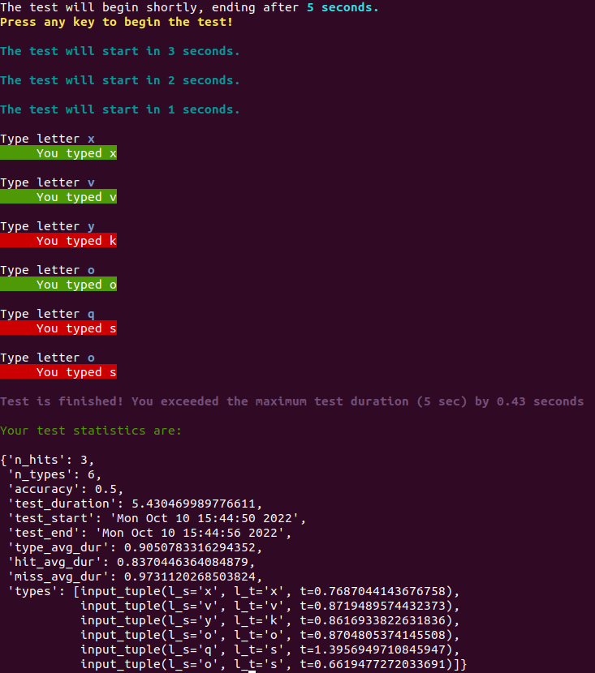

# TypeWriterPSR

This program is called "TypeWriterPSR" and was done as a project for the class "Robotic Systems Programming".

The program can work in two distinct ways: the first one is the counted mode, in which the test has a maximum letter value defined and ends as soon as the limit is reached; the second one is a timed mode, in which the user does it until the time runs out.
The mode of the test is defined right at the beginning, when calling the function, where the user will have to define at least the variable, '*--maximum_value*'. This variable represents the maximum number of letter or seconds of the test. If this is the only variable defined, the test will start in  counted mode by default. If we want to switch to the timed mode, we just have to write the variable '-utm', or '*--user_timed_mode*'.
To start the test, the user just needs to press any key and it will start automatically, after a 3 second countdown. Afterwards, the letter to type will appear. The user should try to write the requested letter as fastest as they can and the answered letter will appear bellow the requested one. If the typed letter is right, the answer text will appear green, but if not, will be red. 
After finishing, the test statistics will appear.
It is also possible to interrupt the test at any point after it started, by pressing the **space bar**.

For it to work, 4 different functions were defined: the *main* function, where we used argparse for the required and optional inputs, checks which mode was selected, calls the corresponding functions and finishes by printing the test statistics. Then there is one function for each game mode, both of which have no input and return the absolute time when the first letter is shown(test start), and also list of namedTuples with the letter shown, typed, and reaction time. Afterwards a function is used to build a dictionary with all the test statistics based on the outputs of the game mode functions.

Also if the player has doubts, he can run the script using **./main.py -h** for instructions on how to execute the script.
